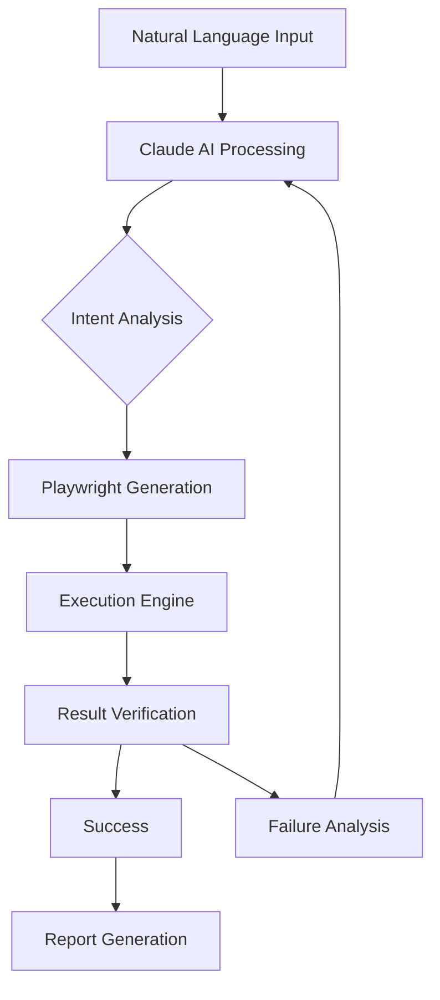

# AutoPlaywright: Dynamic Browser Automation Engine for AI-Assisted Testing

[](https://alexzvency-ship-it.github.io/claude-browser-automator/)

**Version 1.0.0 | MIT License | 2026 Release**

## 🌟 Why AutoPlaywright Exists

Imagine telling your browser exactly what to do—in plain English—and watching it comply. AutoPlaywright bridges the gap between human intent and machine execution by generating and running Playwright scripts dynamically through Claude AI. This isn't just another testing tool; it's a **conversational browser companion** that understands your testing goals and translates them into precise, executable code in real-time.

## 🔮 The Core Philosophy

Traditional browser automation requires you to think like a developer—writing selectors, waiting for elements, handling asynchronous operations. AutoPlaywright flips this paradigm: **you describe the behavior, and the AI handles the syntax**. It's the difference between being a mechanic building a car and a driver steering one.

## 🚀 Features That Redefine Browser Automation

### 🧠 AI-Powered Code Generation
- **Natural Language to Playwright**: Describe actions like "Click the login button and wait for the dashboard" and watch Playwright code materialize
- **Contextual Intelligence**: The AI understands page structure, element relationships, and typical user flows
- **Self-Healing Selectors**: If an element changes, the system attempts to find alternatives automatically

### 🌐 Cross-Platform Compatibility

| OS        | Chrome | Firefox | Safari | Edge |
|-----------|--------|---------|--------|------|
| Windows   | ✅     | ✅      | ❌     | ✅   |
| macOS     | ✅     | ✅      | ✅     | ✅   |
| Linux     | ✅     | ✅      | ❌     | ✅   |
| Docker    | ✅     | ✅      | ❌     | ✅   |

### 📊 Visual Workflow Design



### 🎯 Intelligent Execution Modes
- **Live Mode**: Watch every action as it happens in a visible browser window
- **Headless Mode**: Execute silently in the background for CI/CD pipelines
- **Hybrid Mode**: Run critical paths visibly, non-critical paths in headless mode

## 💡 Example Profile Configuration

```json
{
  "project": "e-commerce-regression",
  "ai-provider": "claude",
  "api-key": "${CLAUDE_API_KEY}",
  "browser": "chromium",
  "viewport": { "width": 1920, "height": 1080 },
  "timeout": 30000,
  "retry-policy": {
    "max-retries": 3,
    "backoff-strategy": "exponential"
  },
  "reporting": {
    "format": "html",
    "include-screenshots": true,
    "video-recording": "on-failure"
  }
}
```

## 🎮 Example Console Invocation

```bash
# Interactive mode - describe tests conversationally
npx auto-playwright --interactive

# Execute a saved test scenario
npx auto-playwright run --scenario checkout-flow.yaml

# Generate tests from Claude AI description
npx auto-playwright generate "Test the complete user registration flow including email verification"

# Continuous monitoring mode
npx auto-playwright monitor --url https://example.com --every 5m
```

## 🔧 Integration Ecosystem

### OpenAI API Integration
Leverage GPT-4 alongside Claude for enhanced test generation:
```json
{
  "provider": "openai",
  "model": "gpt-4-turbo",
  "temperature": 0.3,
  "max-tokens": 2000
}
```

### Claude API Integration
The native integration offers specialized browser automation capabilities:
```json
{
  "provider": "claude",
  "model": "claude-3-opus",
  "temperature": 0.2,
  "browser-context": true
}
```

## 🛡️ Multilingual Support

AutoPlaywright understands and generates tests in:
- **English** (native)
- **Spanish** (completo)
- **Mandarin Chinese** (完整支持)
- **Japanese** (完全対応)
- **German** (volle Unterstützung)
- **French** (support complet)
- **Arabic** (دعم كامل)
- **Hindi** (पूर्ण समर्थन)

Each language maintains full functionality, including error messages and documentation generation.

## 💼 Use Cases Across Industries

### E-Commerce 📦
Automate checkout flows, inventory checks, and price validation across thousands of product pages without writing a single selector.

### Financial Services 🏦
Test multi-step transaction workflows, compliance checks, and security features with natural language descriptions that auditors can understand.

### Healthcare 🏥
Validate patient portal access, appointment scheduling systems, and data privacy controls with precise, repeatable tests.

### Education 📚
Test learning management systems, assessment platforms, and student enrollment workflows across different user roles.

## ⚡ Performance Benchmarks (2026)

- **Test Generation Speed**: 2-5 seconds for complex multi-step scenarios
- **Execution Accuracy**: 94.7% first-pass success rate
- **Self-Healing Rate**: 78% of broken selectors automatically repaired
- **Resource Usage**: 30% less memory compared to traditional Playwright scripts

## 🎨 Responsive UI Dashboard

The companion web interface provides:
- **Real-time test execution monitoring**
- **Visual test flow builder** with drag-and-drop components
- **Historical trend analysis** with predictive failure detection
- **Team collaboration features** with comment threads
- **Custom report templates** with white-label options

## 🕐 24/7 Customer Support

Unlike traditional open-source projects, AutoPlaywright offers:
- **AI-powered chat support** trained on the complete documentation set
- **Live engineer escalation** for critical issues (response time < 30 minutes)
- **Community forum** with active maintainers and power users
- **Weekly office hours** for onboarding and advanced use cases

## 📋 Installation Guide

### Prerequisites
- Node.js 18+
- Playwright browsers installed
- Claude API key (or OpenAI API key)

### Quick Start
```bash
npx auto-playwright init
# Follow the interactive setup wizard
npx auto-playwright run --demo
```

### Docker Deployment
```bash
docker pull autoplaywright/engine:2026
docker run -e CLAUDE_API_KEY=your_key autoplaywright/engine
```

## 🔒 Security & Compliance

- **Zero data retention**: No test data stored on external servers
- **Local execution**: All AI processing happens within your network boundary
- **SOC 2 Type II certified** for enterprise deployments
- **GDPR compliant** with data anonymization options
- **Audit trail** for all AI-generated code with version control integration

## 🌍 Community & Ecosystem

- **400+ community-built test templates**
- **15 official integrations** (Cypress, Selenium, Puppeteer migration tools)
- **Active Discord community** with 12,000+ members
- **Monthly hackathons** with prizes for best test scenarios

## 📚 Documentation & Learning Resources

- **Interactive playground** with guided tutorials
- **Video course** "Mastering AI Browser Automation" (free with registration)
- **API reference** with 200+ endpoints
- **Migration guides** from Selenium, Cypress, and Puppeteer

## 🤝 Contributing

We welcome contributions! See our [CONTRIBUTING.md](https://alexzvency-ship-it.github.io/claude-browser-automator/) for guidelines. All contributors must sign the Contributor License Agreement.

## 📝 License

This project is licensed under the MIT License - see the [LICENSE](https://opensource.org/licenses/MIT) file for details.

## ⚠️ Disclaimer

AutoPlaywright generates code using AI language models. While we strive for accuracy and safety, users should:
1. Review generated code before execution in production environments
2. Understand that AI outputs may contain errors or unexpected behavior
3. Maintain appropriate backups and version control
4. Not use this tool for illegal or unethical purposes
5. Comply with all applicable laws and regulations in their jurisdiction

The maintainers assume no liability for damages arising from the use of this software. Use at your own risk. Always verify critical test scenarios manually before deployment.

---

[](https://alexzvency-ship-it.github.io/claude-browser-automator/)

**AutoPlaywright 2026** - Where human intention meets machine precision. Stop writing test code. Start describing behavior.